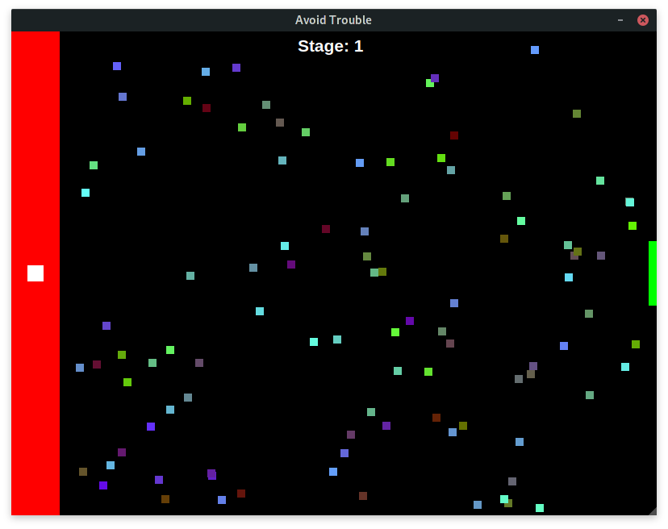

# Avoid Trouble

## Goal

Achieve the highest stage among your friends!

## How to play
- You start from the 'safezone' which is located on the left side, where no balls can kill you.
- Your goal is to reach the green zone which is the 'victory door', without colliding with the obstacle balls!
- When you reach the 'victory door' you advance to the next stage where another obstacle ball is added.

### Controls

- You can use either `W`, `A`, `S`, `D` or the arrow keys to move the player.
- Press `P` to pause the game.
- Press `R` to restart the game.
- Press `ESC` to exit the game.
